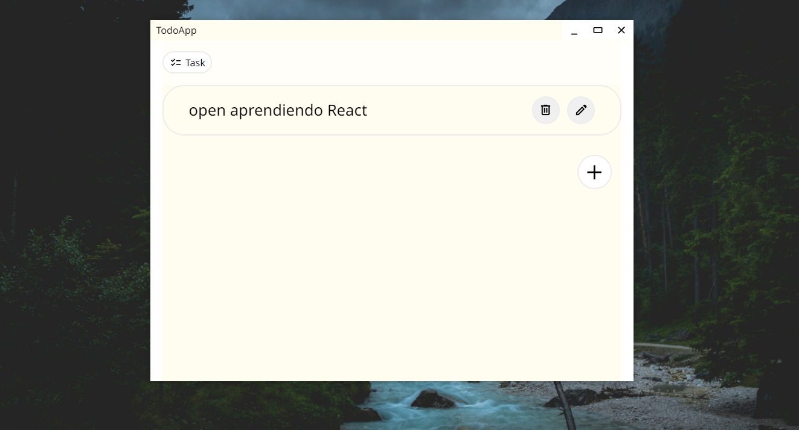

# Productivity App

aplicacion que administra tareas, actualmente se encuentra en desarrollo.

## como ejecutar esta aplicacion

para ejecturar esta aplicacion clone este repositorio

``` bash
git clone https://github.com/Kevin-Illu/productivity-app.git
```
luego ejecturar

``` bash
npm install
npm run start
```