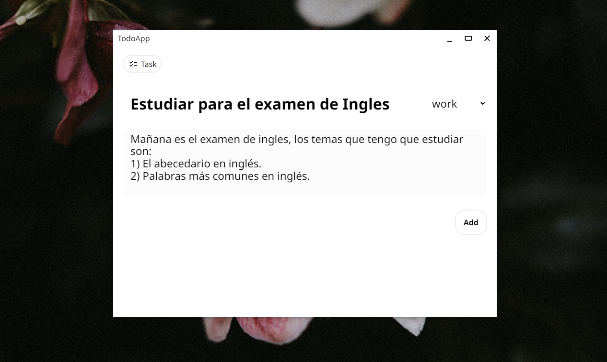

# QuickTask - Productivity Application

Welcome to `QuickTask`, a developing application that helps you manage your tasks. With `QuickTask`, you'll never forget a pending task and you'll be on your way to a more organized and productive life.


## Prerequisites

Before you get started, make sure you have the following installed on your machine:

- Git
- npm
- typescript global
- sass global

## Project Description

QuickTask is a desktop application that allows you to create and manage your daily tasks. With an easy-to-use interface, you can add tasks, mark them as complete and view a list of pending tasks. Additionally, `QuickTask` is a developing application and is open to community contribution.



## How to clone the repository

To clone this repository, open your preferred terminal and run the following command:

```bash
git clone https://github.com/Kevin-Illu/productivity-app.git
```

## How to run the project

Once you have cloned the repository, follow these steps to run `QuickTask` on your machine:

Install all necessary dependencies:

```bash
npm install
```

## Run the project:

```bash
npm run dev
```

If you want to contribute to the development of `QuickTask`, you can also run the following commands to compile the TypeScript and Sass code:
To compile TypeScript while writing code:

```bash
tsc --w
```

To compile Sass files to CSS files while editing scss files run this comand:

```bash
npm run css
```

## How to contribute

If you'd like to contribute to `QuickTask`, that's great! There are many ways you can help, from fixing bugs to adding new features. For more information on how to contribute, check out our contribution file.

## License

SOLID TASK is distributed under the MIT license. For more information, check out our license file.
